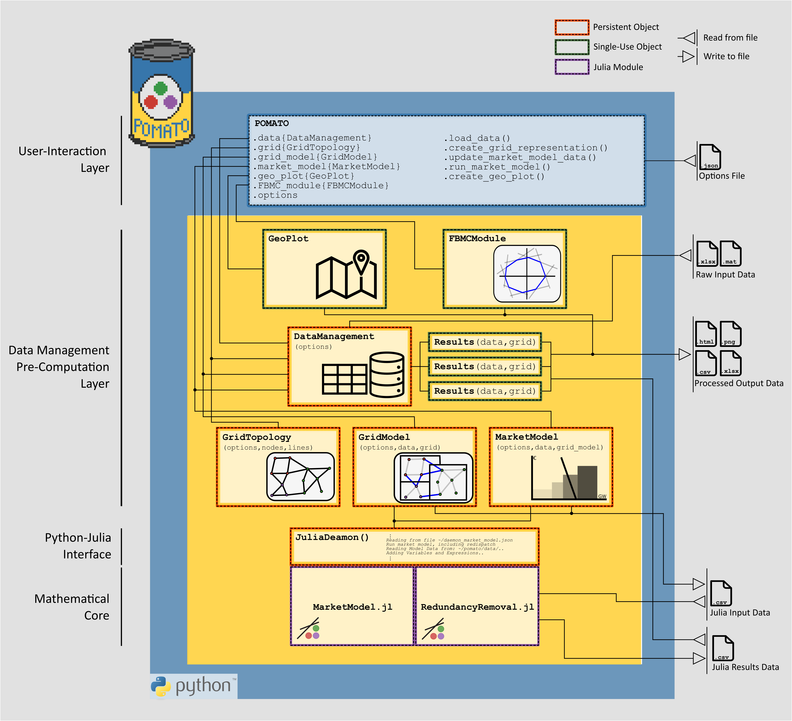

Model Structure
===============

A successful execution of pomato requires three components: Folder structure, valid options and 
correctly formatted input data. While there is some flexibility for each of these components, they 
must abide a general structure that is layed out in the next three subsections. 

While it is generally a good idea to have the program dynamically adopt to all possible inputs, but 
because pomato performs a very specific function it simply requires a certain parametrization to work. 
We have opted to be fairly strict when it comes to definition of data structure and input parameters, 
but made sure the definitions are easily accessible to potentially adopt pomato to other applications. 

.. toctree::
  :maxdepth: 1

  model_formulation
  input_model_data
  options
  line_parameters

  
  POMATO Model Structure. The model core is represented with purple framecolored, the
  data processing layer is incated by a yellow backround, the outer user interface with blue 
  backround.

POMATO is structured in Three Layers: 
  - The mathematical core, represented by two Julia modules, MarketModel and Redundancy Removal.
  - The data processing layer, automates parameter calculation and validation, provides the 
    parameters to the model core, and validates and processes the resulting model output. 
  - User interaction layer, all functionality of POMATO is provided through readable API-like 
    commands and plotting functionality.

See the related publication, available as *preprint*, for more detailed description of the model 
structure `Weinhold and Mieth (2020), Power Market Tool (POMATO) for the Analysis of 
Zonal Electricity Markets <https://arxiv.org/abs/2011.11594>`_.

Running pomato requires besides input data, temporary directories to store data and results from the 
market model or redundancy removal. The idea is to have a working folder to run the model including 
all relevant inputs and store outputs and results. The folder structure is defined as follows and will
be automatically generated when running the model: 

::

    working_directory
    ├── profiles/
    ├── logs/
    ├── data_input/
    ├── data_output/
    ├── data_temp/
        └── julia_files/
             ├── cbco_data/
             ├── results/
             └── data/
